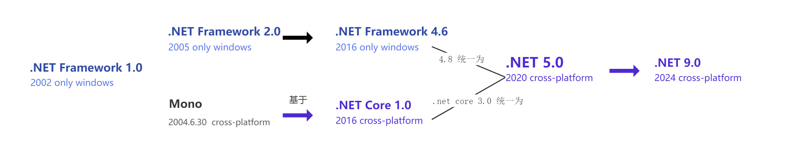
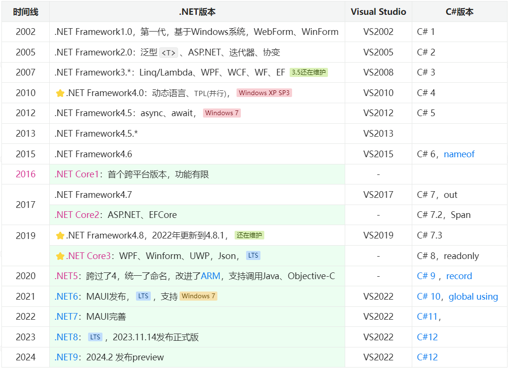
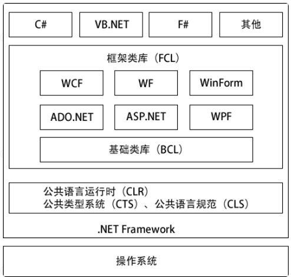
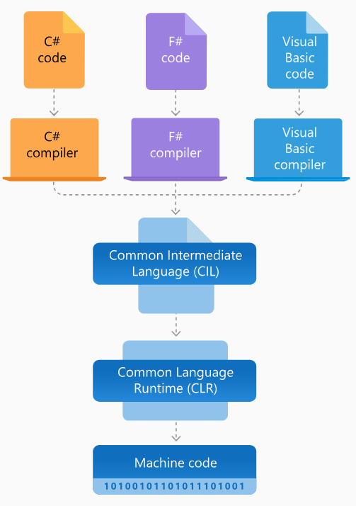
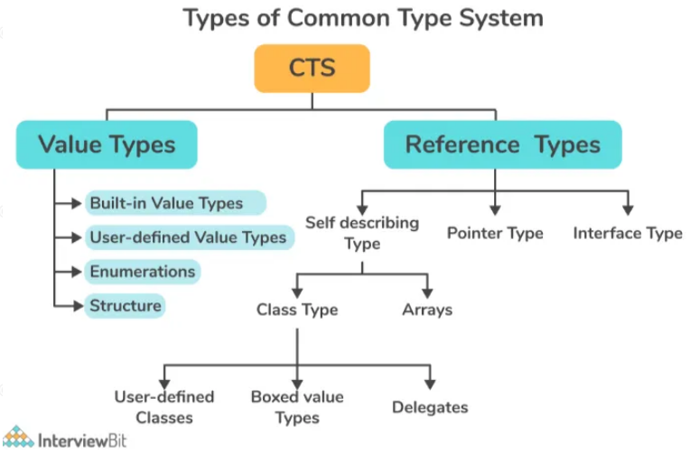
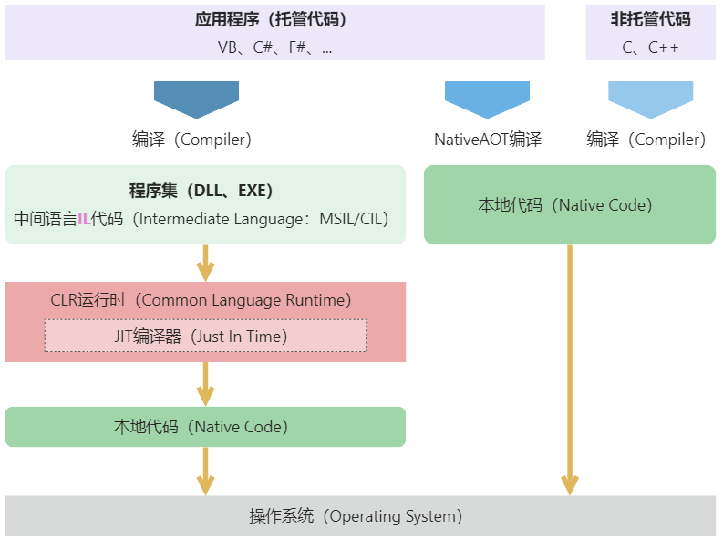

## [.NET 架构须知](#)
> **介绍**：了解.NET 发展历史以及现状，理解.NET Framework、CLR、.NETCore、CTS、JIT等概念。
> [最新版本 .NET 9.0 preview 解读](./contents/dotnet_version_contents_change.md)

### .NET 简介 
.NET 是由 Microsoft 支持的免费开放源代码应用程序平台。

.NET框架有多个实现,如.NET Framework、.NET Core（及后续的.NET 5+版本），以及社区版本Mono。
在2020年，微软将各个实现统一为.NET平台，使得具备完全的跨平台功能。



#### 1.1 发展历史
历时20年，.NET已经前进到 [.NET 9.0](https://learn.microsoft.com/zh-cn/dotnet/core/whats-new/dotnet-9/overview)大版本。



推荐一个在线的版本，做的非常漂亮：[Microsoft .NET History](https://time.graphics/embed?v=1&id=593132)

* .**NET Framework(1.0 —— 4.8.1)**：.NET Framework是基于Windows系统的.NET框架，从2002年发布，到最新的4.8.*版本，已经停止发展。
    * 最后的4.8.*版本依然还在维护，还是可以使用的，支持的最低操作系统是Windows 7。
    * 如果要运行在XP系统上，则只能使用.NET Framework4版本，支持最低Windows XP SP3。
    * .NET Framework是基于Windows系统的，因此也只能在Windows系统上运行。
* .**NET Core(Core1/2/3，5/6/7/8/9)**：从2016年发布首个.NET Core1，和后面的.NET Core2/3、.NET 5/6/7/*是一个体系的，只是从.NET5开始更改了命名。这是微软推出的新一代.NET框架，用来代替原有的.NET Framework，核心特点就是开源、跨平台，这也是.NET未来重点发展、投资的地方。
* **开源** :采用MIT和Apache协议作为开源协议，对商业十分友好。  
* **跨平台** :支持Windows、MacOS、Linux，支持x64,、x86、ARM 架构。

### [.NET Framework 框架](#)
.NET Framework 是运行在 Windows 系列操作系统上的一个系统应用程序。它是 .NET 的核心部分，提供了建立和运行 .NET 应用程序所需要的编辑、 编译等核心服务。它包括2个重要组成部分：公共语言运行时 (Common Language Runtime，CLR) 和 .NET Framework 类库（Framework Class Library，FCL）。




* .NET Framework设计之初就是基于Windows系统的，其API与Windows底层接口紧密关联，所以DotNET应用也只能运行在Windows系统上了。同时，.NET Framework也作为Windows操作系统的组件内置在操作系统中。
* 同一台电脑上可以同时安装多个版本的 .NET Framework 版本。  
* **.NET Framework = 运行时CLR + 类库FCL**。

> 为了解决跨平台的问题，早期是社区开源的 [**Mono**](https://www.mono-project.com/)，后来就是Mono被微软收购后，统一实现并开源了全新的.NET Core框架。不过两者很多技术、概念是一样的。


#### 2.1 .NET程序的编译运行流程
.NET 语言既不是传统意义上的编译语言，也不是传统意义上的解释语言，而是一种混合模式。

* **.NET程序的编译运行流程**：使用 C#、VB.NET 等语言编写源代码文件（通常以 .cs 或 .vb 为扩展名）。
* **编译成中间语言 (Intermediate Language, IL)**：使用编译器（如 csc.exe）将源代码编译成中间语言 (IL) 代码。编译器会生成一个程序集（assembly），通常是一个 .exe 或 .dll 文件。这个文件包含了 IL 代码和元数据。
* **生成程序集**：编译器生成的程序集（.exe 或 .dll 文件）包含了 IL 代码、元数据和必要的资源。
* **加载程序集**: .NET 运行时 (Common Language Runtime, CLR) 负责加载程序集。在运行应用程序时，CLR 会首先查找并加载入口点（通常是 Main 方法）。
* **JIT 编译 (Just-In-Time Compilation)**：当程序集中的方法第一次被调用时，CLR 会使用 JIT 编译器将 IL 代码编译成本机代码。这个过程是在程序运行时完成的，因此称为“即时编译”。
* **执行本机代码**：编译后的本机代码由操作系统的 CPU 执行。CLR 还负责内存管理（包括垃圾回收）、安全性检查、异常处理等任务。
* **垃圾回收 (Garbage Collection, GC)** ：CLR 的垃圾回收器负责自动管理内存，释放不再使用的对象，防止内存泄漏。



**编译阶段**：.NET 语言（如 C#、VB.NET）在开发时首先会通过[MSBuild](https://learn.microsoft.com/zh-cn/visualstudio/msbuild/msbuild?view=vs-2022)编译器编译成中间语言 (Intermediate Language, IL)，也称为微软中间语言 (MSIL) 或公共中间语言 (CIL)。

**运行时解释**：.NET 运行时环境 (Common Language Runtime, CLR) 会负责将中间语言 (IL) 动态编译成本机代码。这个动态编译的过程称为即时编译（Just-In-Time Compilation, JIT）。JIT 编译器在程序运行时将 IL 代码转换为特定平台的本机代码，这部分与解释语言有些相似，因为解释语言也是在运行时进行代码转换和执行的。

#### [2.2 公共语言运行时 (Common Language Runtime，CLR)](#)
**使用面向运行时的语言编译器开发的代码称为托管代码**。 托管代码具有许多优点，例如：跨语言集成、跨语言异常处理、增强的安全性、版本控制和部署支持、简化的组件交互模型、调试和分析服务等。

**元数据**：若要使公共语言运行时能够向托管代码提供服务，语言编译器必须生成一些元数据来描述代码中的类型、成员和引用。 元数据与代码一起存储；每个可加载的公共语言运行时可迁移执行 (PE) 文件都包含元数据。 公共语言运行时使用元数据来完成以下任务：查找和加载类，在内存中安排实例，解析方法调用，生成本机代码，强制安全性，以及设置运行时上下文边界。


* **类加载器**（Class Loader）：加载程序集的类（包括方法）、元数据，及其他程序所需组件。
* **即时编译器JIT**（Just-In-Time，简称JIT ）：负责将中间代码MSIL翻译成本机执行代码（MSIL to Native Code）。
* **代码管理器**（Code Manager）：管理代码的执行。
* **垃圾回收器GC**（Garbage Collector）：负责整个.NET运行时托管代码的内存分配与释放任务，它通过一定的优化算法选择收集对象和时间，并进行自动的垃圾收集。
* **安全引擎**（Security Engine）：提供基于认证的安全机制，如用户身份。
* **调试引擎**（Debug Engine）：使开发者能调试和跟踪应用程序代码。
* **类型检查器**（Type Checker）：检查并禁止非安全的类型转换以及未初始化的变量的使用。
* **异常管理器**（Exception Manager）：提供结构化的异常处理，与Windows结构化异常处理机制（SHE）集成，改进了错误报告。
* **线程支持**（Thread Support）：提供了多线程编程的类和接口。

> CLR是.NET的核心，当我们学习了基本C#语法后，想要进一步进阶，就必须了解CLR的机制了。

#### [2.3 通用类型系统(Common Type System，CTS)](#)
微软制定了一个正式的规范来描述类型的定义和行为，这就是“[通用类型系统](https://learn.microsoft.com/zh-cn/dotnet/standard/base-types/common-type-system)”（Common Type System，[CTS](https://learn.microsoft.com/zh-cn/dotnet/standard/base-types/common-type-system)）。所有.NET语言共享这一类型系统，实现它们之间无缝的互操作，比如可以在VB.NET中派生一个由C#编写的类。

* CTS 提供了2种类型：**引用类型**、**值类型**。
* CTS 规范规定，一个类型可以包含零个或多个成员。这些成员包括：字段(Field)、属性(Property)、方法(Method)、事件(Event)。
* CTS 指定了类型可见性规则以及类型成员的访问规则，private、public 等。
* CTS 还为类型继承、虚方法、对象生存期等定义了相应的规则。
* CTS 规定：所有类型最终必须从预定义的 System.Object 类型继承，这里包括值类型也是从Object继承而来的。



#### [2.4 公共语言规范(Common Language Specifition, CLS)](#)
[公共语言规范](https://learn.microsoft.com/zh-cn/dotnet/standard/language-independence)(Common Language Specifition，CLS）是CTS的一个子集，从类型、命名、事件、属性等方面对语言进行了共性的定义及规范。CLS制定了一种以.NET平台为目标的语言所必须支持的最小特征，以及该语言与其他.NET语言之间实现互操作性所需要的完备特征。例如，CLS并不去关心一种语言用什么关键字实现继承，只是关心该语言如何支持继承。

|符合 CLS 的类型|描述|
|:----|:----|
|Byte|8位无符号整数|
|Int16|16 位带符号整数|
|Int32|32 位带符号整数|
|Int64|64 位带符号整数|
|Half|半精度浮点值|
|单精度|单精度浮点值|
|双精度|双精度浮点值|
|布尔值|true 或 false 值类型|
|Char|UTF 16 编码单元|
|小数|非浮点十进制数字|
|IntPtr平台定义的大小的指针或句柄|
|字符串|零个、一个或多个 Char 对象的集合|

#### [2.5 DotNET Framework 类库](#)
类库（Framework Class Library，**FCL**）就是.NET Framework内置的各种组件服务，如ASP.NET、MVC、WCF和WPF等组件，满足不同编程应用场景的需求。

基础类库**BCL**（Base Class Library）是FCL的一个子集，顾名思义就是一些比较基础、通用的类库，如基本数据类型、集合、线程、安全、字符串操作、网络操作、IO、XML操作等等，大多都包含在System命名空间下，如System.Text、System.IO。其他一些常用的名词，如核心 .NET 库、框架库、运行时库、共享框架，大多都指的是BCL。

```c#
// 这些都是DotNET内置的类库
using System;
using System.Collections.Generic;
using System.Linq;
using System.Text;
using System.IO;
using System.Threading.Tasks;
```
BCL作为FCL的基础，使用了CTS 数据类型和标准的应用程序格式编制，能被任何一种 .NET 编程语言的应用程序所使用。

### [.NET Core 框架](#)
.NET Core是一个免费、跨平台、开源的开发平台，用于一站式构建不同类型的应用程序。.NET Core 是以.NET Framework 为基础，但是经过重新设计、实现的的新一代框架，实现了原.NET Framework 中的几乎所有功能，核心特点就是开源、跨平台。

> NET Core 从2016年发布首个.NET Core1，后面陆续发布了.NET Core2、.NET Core3，及后续的.NET6、.NET7、.NET8、.NET9。

### [统一的.NET框架](#)
.NET框架体系经过多年发展，衍生了多个版本 —— 使用 .NET Framework 来构建 Windows 桌面应用程序，使用 Xamarin 来构建 iOS 或 Android 应用程序，使用 .NET Core 来构建跨平台的 Web 应用程序。每一个框架都有自己的BCL、运行时CLR，长此以往，这也是造成如今.NET市场越来越差的原因之一。

为解决这个问题，.NET Core就肩负了这个一统江湖的使命！ 

* .NET 5统一了Mono和.NET Core BCL的代码库。
* 在.NET 6中，运行时和工具也统一了，完成了One .NET愿景。
* .NET 7 统一了所有不同的 .NET 开发工具组件，使开发人员能够在相同的基础类库 （BCL）、运行时和编译器上构建所有类型的应用（桌面、移动、Web 等）。


### [.NET Runtime](#)
运行时.NET Runtime 有两种，**CoreCLR**，功能和.NET Framework的CLR差不多；**.NET Native RunTime**（CoreRT/**NativeAOT**）是直接将C#代码编译为机器码的运行时，还只是一个实验性的运行时。

> Core CLR 是一个跨平台的运行时，移植了 .NET Framework 的 CLR 的功能，包含核心程序库 mscorlib、JIT 编译器、垃圾收集器 (GC) 以及其他运行 MSIL 所需要的运行期环境。

* BCL/CoreFX，类库，即 Base Classlibrary 基础类，包含 File、System、Console、XML、ADO.NET、日期时间等类库。Core FX就是.NET Core的BCL。
* App Model，一站式构建 Web、桌面和移动等应用的模型。

### [JIT、AOT编译](#)
通常情况下，我们写的C#代码被编译为中间代码**IL**，在运行期间由CLR的JIT编译器编译为机器码执行。这样势必造成运行的一些延迟，**如果知道目标平台**，则可以为该目标平台提前编译为**机器码**，这就是所谓的提前编译（AOT），它的优点是**启动时间更快**。

- **JIT**（Just In Time Compiler，即时编译），顾名思义，在需要（运行代码）的时候才会被编译为机器码。当然编译好后会被缓存，以便于后续执行，这也是为什么.NET程序预热后执行更快的原因，不过程序关闭就没了。
- **AOT** 编译（Ahead of Time Compilation，预先编译或静态编译），在构建（发布）时将高级语言编译为本地机器码，让程序更快的启动、运行。可以将.NET Core程序编译成原生（机器）代码，不依赖 .NET 运行时而运行在宿主机器上。



CoreRT 是应用了AOT编译的.NET本地运行时，是微软2014年推出的一项实验性技术，现在被库runtimelab取代，是一个NativeAOT的实验性运行时。

不同于CoreCLR，CoreRT不是虚拟机，也没有生成和动态运行代码的能力，因为它不包括JIT。它具有RTTI（运行时类型标识）和反射的能力，同时还具备垃圾回收（Garbage Collector）功能。Core RT 会在不同的平台使用不同的 AOT 技术：

* Windows 上使用的是 .**NET Native**。
* macOS 与 Linux 上使用的是 **LLILC** (同时支持 JIT 和 AOT)。